# Exploring the Relationship between 21st-Century Movie Revenue and Year, Runtime, Popularity, and Budget

## Table of Contents
<ul>
<li><a href="#intro">Introduction</a></li>
<li><a href="#wrangling">Data Wrangling</a></li>
<li><a href="#eda">Exploratory Data Analysis</a></li>
<li><a href="#conclusions">Conclusions</a></li>
</ul>

<a id='intro'></a>
## Introduction

> The data used in the following sections is from https://github.com/udacity/new-dand-basic-china/blob/master/%E6%95%B0%E6%8D%AE%E5%88%86%E6%9E%90%E5%85%A5%E9%97%A8/%E9%A1%B9%E7%9B%AE-%E6%8E%A2%E7%B4%A2%E6%95%B0%E6%8D%AE%E9%9B%86/%E6%8E%A2%E7%B4%A2%E6%95%B0%E6%8D%AE%E9%9B%86%20-%20%E5%A4%87%E9%80%89%E6%95%B0%E6%8D%AE%E9%9B%86.md


```python
import numpy as np
import pandas as pd
import matplotlib.pyplot as plt
import seaborn as sns

%matplotlib inline
```

> This markdown aims to explore the relationship between movie revenue and year, runtime, popularity, and budget in the 21st century.

<a id='wrangling'></a>
## Data Wrangling


### General Properties


```python
df = pd.read_csv('tmdb-movies.csv')
```


```python
df.shape
```


    (10866, 21)


> Through df.shape command, we know the number of rows and columns of the dataset. This dataset includes 10,866 observations, with 21 variables.


```python
df.head(3)
```

<table border="1" class="dataframe">
  <thead>
    <tr style="text-align: right;">
      <th></th>
      <th>id</th>
      <th>imdb_id</th>
      <th>popularity</th>
      <th>budget</th>
      <th>revenue</th>
      <th>original_title</th>
      <th>cast</th>
      <th>homepage</th>
      <th>director</th>
      <th>tagline</th>
      <th>...</th>
      <th>overview</th>
      <th>runtime</th>
      <th>genres</th>
      <th>production_companies</th>
      <th>release_date</th>
      <th>vote_count</th>
      <th>vote_average</th>
      <th>release_year</th>
      <th>budget_adj</th>
      <th>revenue_adj</th>
    </tr>
  </thead>
  <tbody>
    <tr>
      <th>0</th>
      <td>135397</td>
      <td>tt0369610</td>
      <td>32.985763</td>
      <td>150000000</td>
      <td>1513528810</td>
      <td>Jurassic World</td>
      <td>Chris Pratt|Bryce Dallas Howard|Irrfan Khan|Vi...</td>
      <td>http://www.jurassicworld.com/</td>
      <td>Colin Trevorrow</td>
      <td>The park is open.</td>
      <td>...</td>
      <td>Twenty-two years after the events of Jurassic ...</td>
      <td>124</td>
      <td>Action|Adventure|Science Fiction|Thriller</td>
      <td>Universal Studios|Amblin Entertainment|Legenda...</td>
      <td>6/9/15</td>
      <td>5562</td>
      <td>6.5</td>
      <td>2015</td>
      <td>1.379999e+08</td>
      <td>1.392446e+09</td>
    </tr>
    <tr>
      <th>1</th>
      <td>76341</td>
      <td>tt1392190</td>
      <td>28.419936</td>
      <td>150000000</td>
      <td>378436354</td>
      <td>Mad Max: Fury Road</td>
      <td>Tom Hardy|Charlize Theron|Hugh Keays-Byrne|Nic...</td>
      <td>http://www.madmaxmovie.com/</td>
      <td>George Miller</td>
      <td>What a Lovely Day.</td>
      <td>...</td>
      <td>An apocalyptic story set in the furthest reach...</td>
      <td>120</td>
      <td>Action|Adventure|Science Fiction|Thriller</td>
      <td>Village Roadshow Pictures|Kennedy Miller Produ...</td>
      <td>5/13/15</td>
      <td>6185</td>
      <td>7.1</td>
      <td>2015</td>
      <td>1.379999e+08</td>
      <td>3.481613e+08</td>
    </tr>
    <tr>
      <th>2</th>
      <td>262500</td>
      <td>tt2908446</td>
      <td>13.112507</td>
      <td>110000000</td>
      <td>295238201</td>
      <td>Insurgent</td>
      <td>Shailene Woodley|Theo James|Kate Winslet|Ansel...</td>
      <td>http://www.thedivergentseries.movie/#insurgent</td>
      <td>Robert Schwentke</td>
      <td>One Choice Can Destroy You</td>
      <td>...</td>
      <td>Beatrice Prior must confront her inner demons ...</td>
      <td>119</td>
      <td>Adventure|Science Fiction|Thriller</td>
      <td>Summit Entertainment|Mandeville Films|Red Wago...</td>
      <td>3/18/15</td>
      <td>2480</td>
      <td>6.3</td>
      <td>2015</td>
      <td>1.012000e+08</td>
      <td>2.716190e+08</td>
    </tr>
  </tbody>
</table>
<p>3 rows × 21 columns</p>
</div>


> Using df.head, we get the first rows of the movie dataset.


```python
df.info()
```

    <class 'pandas.core.frame.DataFrame'>
    RangeIndex: 10866 entries, 0 to 10865
    Data columns (total 21 columns):
    id                      10866 non-null int64
    imdb_id                 10856 non-null object
    popularity              10866 non-null float64
    budget                  10866 non-null int64
    revenue                 10866 non-null int64
    original_title          10866 non-null object
    cast                    10790 non-null object
    homepage                2936 non-null object
    director                10822 non-null object
    tagline                 8042 non-null object
    keywords                9373 non-null object
    overview                10862 non-null object
    runtime                 10866 non-null int64
    genres                  10843 non-null object
    production_companies    9836 non-null object
    release_date            10866 non-null object
    vote_count              10866 non-null int64
    vote_average            10866 non-null float64
    release_year            10866 non-null int64
    budget_adj              10866 non-null float64
    revenue_adj             10866 non-null float64
    dtypes: float64(4), int64(6), object(11)
    memory usage: 1.3+ MB
    

> df.info returns the number of nulls in, and the data type of each column.


```python
df.isnull().sum()
```


    id                         0
    imdb_id                   10
    popularity                 0
    budget                     0
    revenue                    0
    original_title             0
    cast                      76
    homepage                7930
    director                  44
    tagline                 2824
    keywords                1493
    overview                   4
    runtime                    0
    genres                    23
    production_companies    1030
    release_date               0
    vote_count                 0
    vote_average               0
    release_year               0
    budget_adj                 0
    revenue_adj                0
    dtype: int64


> Here, we calculate the number of nulls in each column.


```python
df.duplicated().sum()
```


    1


> There is one duplicated row in the dataset.


### Data Cleaning


```python
df_21 = df.query('release_year>=2000')
```

> Since we only care about the movies in the 21st century, the first step in this section is to filter the corresponding rows.


```python
index = ['original_title', 'revenue_adj', 'budget_adj', 'runtime', 'popularity', 'release_year']
df_21 = df_21[index]
```

> In addition, we extract the columns that are of interest.


```python
df_21.shape
```


    (7168, 6)


```python
df_21.isnull().sum()
```


    original_title    0
    revenue_adj       0
    budget_adj        0
    runtime           0
    popularity        0
    release_year      0
    dtype: int64


```python
df_21.info()
```

    <class 'pandas.core.frame.DataFrame'>
    Int64Index: 7168 entries, 0 to 8887
    Data columns (total 6 columns):
    original_title    7168 non-null object
    revenue_adj       7168 non-null float64
    budget_adj        7168 non-null float64
    runtime           7168 non-null int64
    popularity        7168 non-null float64
    release_year      7168 non-null int64
    dtypes: float64(3), int64(2), object(1)
    memory usage: 364.0+ KB
    


```python
df_21.describe()
```


<table border="1" class="dataframe">
  <thead>
    <tr style="text-align: right;">
      <th></th>
      <th>revenue_adj</th>
      <th>budget_adj</th>
      <th>runtime</th>
      <th>popularity</th>
      <th>release_year</th>
    </tr>
  </thead>
  <tbody>
    <tr>
      <th>count</th>
      <td>7.168000e+03</td>
      <td>7.168000e+03</td>
      <td>7168.000000</td>
      <td>7168.000000</td>
      <td>7168.000000</td>
    </tr>
    <tr>
      <th>mean</th>
      <td>4.501970e+07</td>
      <td>1.767841e+07</td>
      <td>99.737723</td>
      <td>0.693524</td>
      <td>2009.018136</td>
    </tr>
    <tr>
      <th>std</th>
      <td>1.326838e+08</td>
      <td>3.632479e+07</td>
      <td>33.352364</td>
      <td>1.129084</td>
      <td>4.341236</td>
    </tr>
    <tr>
      <th>min</th>
      <td>0.000000e+00</td>
      <td>0.000000e+00</td>
      <td>0.000000</td>
      <td>0.000620</td>
      <td>2000.000000</td>
    </tr>
    <tr>
      <th>25%</th>
      <td>0.000000e+00</td>
      <td>0.000000e+00</td>
      <td>89.000000</td>
      <td>0.204303</td>
      <td>2006.000000</td>
    </tr>
    <tr>
      <th>50%</th>
      <td>0.000000e+00</td>
      <td>0.000000e+00</td>
      <td>97.000000</td>
      <td>0.390768</td>
      <td>2010.000000</td>
    </tr>
    <tr>
      <th>75%</th>
      <td>2.319898e+07</td>
      <td>1.894612e+07</td>
      <td>109.000000</td>
      <td>0.767455</td>
      <td>2013.000000</td>
    </tr>
    <tr>
      <th>max</th>
      <td>2.827124e+09</td>
      <td>4.250000e+08</td>
      <td>900.000000</td>
      <td>32.985763</td>
      <td>2015.000000</td>
    </tr>
  </tbody>
</table>
</div>


> From the summary statistics, we can detect whether there exists outliers in the dataset. Please note that the min of both revenue and budget equal zero. Besides, the maximum of runtime is 900 minutes, which is not normal for a movie. In fact, the items in the TMDb dataset include not only movies but also TV shows, such as Frank Herbert's Dune. Consequently, for the following analyses, we will focus on those whose runtime is between 60 to 180 minutes.


```python
df_21 = df_21.query('runtime >= 60 and runtime < 180 and revenue_adj > 0 and budget_adj > 0')
```


```python
df_21.describe()
```


<table border="1" class="dataframe">
  <thead>
    <tr style="text-align: right;">
      <th></th>
      <th>revenue_adj</th>
      <th>budget_adj</th>
      <th>runtime</th>
      <th>popularity</th>
      <th>release_year</th>
    </tr>
  </thead>
  <tbody>
    <tr>
      <th>count</th>
      <td>2.489000e+03</td>
      <td>2.489000e+03</td>
      <td>2489.000000</td>
      <td>2489.000000</td>
      <td>2489.000000</td>
    </tr>
    <tr>
      <th>mean</th>
      <td>1.259005e+08</td>
      <td>4.628817e+07</td>
      <td>107.756529</td>
      <td>1.332739</td>
      <td>2008.062274</td>
    </tr>
    <tr>
      <th>std</th>
      <td>1.986547e+08</td>
      <td>4.857005e+07</td>
      <td>17.115557</td>
      <td>1.674664</td>
      <td>4.403181</td>
    </tr>
    <tr>
      <th>min</th>
      <td>2.370705e+00</td>
      <td>9.693980e-01</td>
      <td>62.000000</td>
      <td>0.001117</td>
      <td>2000.000000</td>
    </tr>
    <tr>
      <th>25%</th>
      <td>1.514377e+07</td>
      <td>1.266292e+07</td>
      <td>95.000000</td>
      <td>0.513438</td>
      <td>2005.000000</td>
    </tr>
    <tr>
      <th>50%</th>
      <td>5.669017e+07</td>
      <td>2.995307e+07</td>
      <td>105.000000</td>
      <td>0.895829</td>
      <td>2008.000000</td>
    </tr>
    <tr>
      <th>75%</th>
      <td>1.464947e+08</td>
      <td>6.255997e+07</td>
      <td>117.000000</td>
      <td>1.535278</td>
      <td>2012.000000</td>
    </tr>
    <tr>
      <th>max</th>
      <td>2.827124e+09</td>
      <td>4.250000e+08</td>
      <td>179.000000</td>
      <td>32.985763</td>
      <td>2015.000000</td>
    </tr>
  </tbody>
</table>
</div>


> The current dataset does not contain any outliers anymore.


```python
df_21.duplicated().sum()
```


    1


```python
df_21.drop_duplicates(inplace = True)
```


```python
df_21.duplicated().sum()
```


    0


> These previous three steps remove the duplicated observations in the dataset.


```python
df_21['release_year'] = pd.to_datetime(df_21['release_year'], format = '%Y')
```

> We change the data type of release year here.


```python
df_21.rename(columns = {'revenue_adj':'revenue', 'budget_adj': 'budget'}, inplace = True)
```

> Simplify the row names of a few variables.


```python
df_21.tail()
```


<table border="1" class="dataframe">
  <thead>
    <tr style="text-align: right;">
      <th></th>
      <th>original_title</th>
      <th>revenue</th>
      <th>budget</th>
      <th>runtime</th>
      <th>popularity</th>
      <th>release_year</th>
    </tr>
  </thead>
  <tbody>
    <tr>
      <th>8862</th>
      <td>Shadow of the Vampire</td>
      <td>1.048365e+07</td>
      <td>1.013034e+07</td>
      <td>92</td>
      <td>0.119214</td>
      <td>2000-01-01</td>
    </tr>
    <tr>
      <th>8866</th>
      <td>The Adventures of Rocky &amp; Bullwinkle</td>
      <td>4.449095e+07</td>
      <td>9.623820e+07</td>
      <td>88</td>
      <td>0.104908</td>
      <td>2000-01-01</td>
    </tr>
    <tr>
      <th>8868</th>
      <td>The Big Kahuna</td>
      <td>4.721861e+06</td>
      <td>8.864045e+06</td>
      <td>90</td>
      <td>0.091492</td>
      <td>2000-01-01</td>
    </tr>
    <tr>
      <th>8881</th>
      <td>Hanging Up</td>
      <td>4.563452e+07</td>
      <td>5.065168e+07</td>
      <td>94</td>
      <td>0.031018</td>
      <td>2000-01-01</td>
    </tr>
    <tr>
      <th>8883</th>
      <td>The In Crowd</td>
      <td>6.606877e+06</td>
      <td>1.899438e+07</td>
      <td>105</td>
      <td>0.015997</td>
      <td>2000-01-01</td>
    </tr>
  </tbody>
</table>
</div>


<a id='eda'></a>
## Exploratory Data Analysis


### 1: Revenue of Movies in the 21st Century

#### Independent Variable: release year, Dependent Variable: revenue


```python
year_revenue = df_21.groupby('release_year')['revenue'].sum()
```


```python
year_revenue
```


    release_year
    2000-01-01    1.386587e+10
    2001-01-01    1.575690e+10
    2002-01-01    1.746921e+10
    2003-01-01    1.615183e+10
    2004-01-01    1.903185e+10
    2005-01-01    1.735184e+10
    2006-01-01    1.691787e+10
    2007-01-01    1.957748e+10
    2008-01-01    1.911324e+10
    2009-01-01    2.196150e+10
    2010-01-01    2.180349e+10
    2011-01-01    2.269191e+10
    2012-01-01    2.296905e+10
    2013-01-01    2.242611e+10
    2014-01-01    2.217063e+10
    2015-01-01    2.410668e+10
    Name: revenue, dtype: float64


> We sum the total number of revenue in each year.


```python
sns.set_style('whitegrid')

year_revenue.plot(figsize = (10,6), color = 'orange')
plt.xlabel('Year')
plt.ylabel('Revenue in e10')
plt.title('Total Movie Revenue from 2000 to 2015');
```


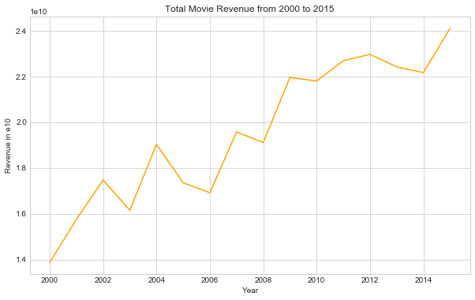


From the line plot above, we can see overall, the revenue increases from 2000 to 2015, but the numbers fluctuate quite a bit. For instance, the total revenue first increased then decreased from 2000 to 2003. What might also worth noticing is that the revenues is impacted by inflation. In other words, the value of 1 dollar differs in 2000 and 2015. For future research, we may consider using 2015 inflation level to normalize the movie revenues.

### 2: Relationship between Revenue and Runtime

#### Independent Variable: Runtime, Dependent Variable: Revenue


```python
df_21.head()
```


<table border="1" class="dataframe">
  <thead>
    <tr style="text-align: right;">
      <th></th>
      <th>original_title</th>
      <th>revenue</th>
      <th>budget</th>
      <th>runtime</th>
      <th>popularity</th>
      <th>release_year</th>
    </tr>
  </thead>
  <tbody>
    <tr>
      <th>0</th>
      <td>Jurassic World</td>
      <td>1.392446e+09</td>
      <td>1.379999e+08</td>
      <td>124</td>
      <td>32.985763</td>
      <td>2015-01-01</td>
    </tr>
    <tr>
      <th>1</th>
      <td>Mad Max: Fury Road</td>
      <td>3.481613e+08</td>
      <td>1.379999e+08</td>
      <td>120</td>
      <td>28.419936</td>
      <td>2015-01-01</td>
    </tr>
    <tr>
      <th>2</th>
      <td>Insurgent</td>
      <td>2.716190e+08</td>
      <td>1.012000e+08</td>
      <td>119</td>
      <td>13.112507</td>
      <td>2015-01-01</td>
    </tr>
    <tr>
      <th>3</th>
      <td>Star Wars: The Force Awakens</td>
      <td>1.902723e+09</td>
      <td>1.839999e+08</td>
      <td>136</td>
      <td>11.173104</td>
      <td>2015-01-01</td>
    </tr>
    <tr>
      <th>4</th>
      <td>Furious 7</td>
      <td>1.385749e+09</td>
      <td>1.747999e+08</td>
      <td>137</td>
      <td>9.335014</td>
      <td>2015-01-01</td>
    </tr>
  </tbody>
</table>
</div>


```python
plt.hist(df_21['revenue'])

plt.xlabel('Revenue')
plt.ylabel('Count')
plt.title('Distribution of Revenue');
```


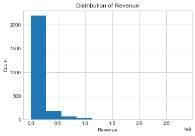


> Apparently, the distribution of revenue is skewed.


```python
plt.hist(df_21['runtime'])

plt.xlabel('Runtime')
plt.ylabel('Count')
plt.title('Distribution of Runtime');
```


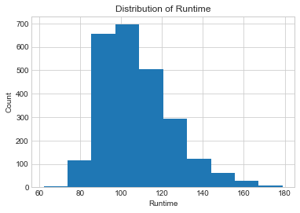


> The distribution of runtime shows a similar pattern, but it's not as skewed as the one of revenue.


```python
df_21[['revenue', 'runtime']].corr()
```


<table border="1" class="dataframe">
  <thead>
    <tr style="text-align: right;">
      <th></th>
      <th>revenue</th>
      <th>runtime</th>
    </tr>
  </thead>
  <tbody>
    <tr>
      <th>revenue</th>
      <td>1.000000</td>
      <td>0.319021</td>
    </tr>
    <tr>
      <th>runtime</th>
      <td>0.319021</td>
      <td>1.000000</td>
    </tr>
  </tbody>
</table>
</div>


> We calculate the Pearson Correlation Coefficient to see the extent to which these two variables are associated.


```python
sns.set_context('notebook')
sns.regplot(x=df_21["runtime"], y=df_21["revenue"], fit_reg=True)

plt.xlabel('Runtime')
plt.ylabel('Revenue in e9')
plt.title('Runtime vs. Revenue');
```


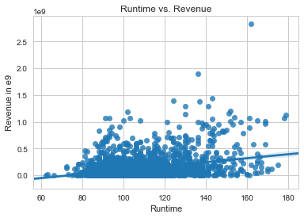


> With the seaborn library, we can produce the scatterplot and the regression fit line here.


```python
df_21['runtime'].describe()
```


    count    2488.000000
    mean      107.762862
    std        17.116081
    min        62.000000
    25%        95.000000
    50%       105.000000
    75%       117.000000
    max       179.000000
    Name: runtime, dtype: float64


```python
bin_edges = [62, 95, 105, 117, 179]
bin_names = ['short','mid', 'mid-long', 'long']

df_21['runtime_level'] = pd.cut(df_21['runtime'], bin_edges, labels=bin_names)
```

> We recode the runtime variable into four categories using quantile breaks.


```python
df_21['runtime_level'].value_counts()
```


    mid         650
    short       638
    long        620
    mid-long    579
    Name: runtime_level, dtype: int64


```python
df_21.groupby('runtime_level')['revenue'].mean()
```


    runtime_level
    short       9.327396e+07
    mid         8.754680e+07
    mid-long    1.084389e+08
    long        2.163937e+08
    Name: revenue, dtype: float64


> The average values of revenue are given by the code above.


```python
sns.boxplot(x=df_21['runtime_level'], y=df_21['revenue'])

plt.xlabel('Runtime')
plt.ylabel('Revenue in e9')
plt.title('Runtime vs. Revenue');
```


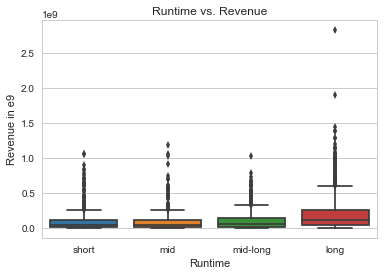


In this section, we look into the relationship between revenue and runtime. First of all, the correlation coefficient equals 0.319, indicating a relatively weak linear relationship between the two variables. This aspect is also proven by the later scatterplot. In addition, we separate the runtime into four categories, and calculate the average revenue of each class. Surprisingly, the average revenue of "mid" is lower than the one of "short". It means that the movie revenue will not follow the same trend of runtime. As can be seen in the boxplot, the distribution of the first three classes are very similar.

### 3: Relationship between Revenue and Popularity

#### Independent Variable: popularity, Dependent Variable: Revenue


```python
df_21.head()
```


<table border="1" class="dataframe">
  <thead>
    <tr style="text-align: right;">
      <th></th>
      <th>original_title</th>
      <th>revenue</th>
      <th>budget</th>
      <th>runtime</th>
      <th>popularity</th>
      <th>release_year</th>
      <th>runtime_level</th>
    </tr>
  </thead>
  <tbody>
    <tr>
      <th>0</th>
      <td>Jurassic World</td>
      <td>1.392446e+09</td>
      <td>1.379999e+08</td>
      <td>124</td>
      <td>32.985763</td>
      <td>2015-01-01</td>
      <td>long</td>
    </tr>
    <tr>
      <th>1</th>
      <td>Mad Max: Fury Road</td>
      <td>3.481613e+08</td>
      <td>1.379999e+08</td>
      <td>120</td>
      <td>28.419936</td>
      <td>2015-01-01</td>
      <td>long</td>
    </tr>
    <tr>
      <th>2</th>
      <td>Insurgent</td>
      <td>2.716190e+08</td>
      <td>1.012000e+08</td>
      <td>119</td>
      <td>13.112507</td>
      <td>2015-01-01</td>
      <td>long</td>
    </tr>
    <tr>
      <th>3</th>
      <td>Star Wars: The Force Awakens</td>
      <td>1.902723e+09</td>
      <td>1.839999e+08</td>
      <td>136</td>
      <td>11.173104</td>
      <td>2015-01-01</td>
      <td>long</td>
    </tr>
    <tr>
      <th>4</th>
      <td>Furious 7</td>
      <td>1.385749e+09</td>
      <td>1.747999e+08</td>
      <td>137</td>
      <td>9.335014</td>
      <td>2015-01-01</td>
      <td>long</td>
    </tr>
  </tbody>
</table>
</div>


```python
plt.hist(df_21['popularity'])

plt.xlabel('Popularity')
plt.ylabel('Count')
plt.title('Distribution of Popularity');
```


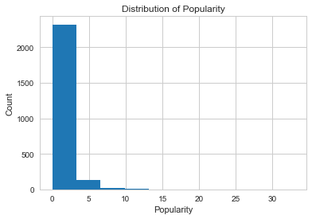


> Analogous to revenue, the distribution of popularity is right-skewed.


```python
df_21[['revenue', 'popularity']].corr()
```


<table border="1" class="dataframe">
  <thead>
    <tr style="text-align: right;">
      <th></th>
      <th>revenue</th>
      <th>popularity</th>
    </tr>
  </thead>
  <tbody>
    <tr>
      <th>revenue</th>
      <td>1.000000</td>
      <td>0.595301</td>
    </tr>
    <tr>
      <th>popularity</th>
      <td>0.595301</td>
      <td>1.000000</td>
    </tr>
  </tbody>
</table>
</div>


```python
sns.regplot(x=df_21["popularity"], y=df_21["revenue"], fit_reg=True)

plt.xlabel('Popularity')
plt.ylabel('Revenue in e9')
plt.title('Popularity vs. Revenue');
```


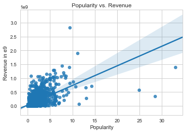


```python
df_21['popularity'].describe()
```


    count    2488.000000
    mean        1.333035
    std         1.674936
    min         0.001117
    25%         0.513318
    50%         0.896547
    75%         1.536028
    max        32.985763
    Name: popularity, dtype: float64


```python
bin_edges1 = [df_21['popularity'].describe()['min'], df_21['popularity'].describe()['25%'], df_21['popularity'].describe()['50%'], 
              df_21['popularity'].describe()['75%'], df_21['popularity'].describe()['max']]
bin_names1 = ['low','mid', 'mid-high', 'high']

df_21['pop_level'] = pd.cut(df_21['popularity'], bin_edges1, labels=bin_names1)
```


```python
df_21.tail(15)
```


<table border="1" class="dataframe">
  <thead>
    <tr style="text-align: right;">
      <th></th>
      <th>original_title</th>
      <th>revenue</th>
      <th>budget</th>
      <th>runtime</th>
      <th>popularity</th>
      <th>release_year</th>
      <th>runtime_level</th>
      <th>pop_level</th>
    </tr>
  </thead>
  <tbody>
    <tr>
      <th>8798</th>
      <td>Under Suspicion</td>
      <td>3.299476e+05</td>
      <td>3.165730e+07</td>
      <td>110</td>
      <td>0.471019</td>
      <td>2000-01-01</td>
      <td>mid-long</td>
      <td>low</td>
    </tr>
    <tr>
      <th>8799</th>
      <td>Ready to Rumble</td>
      <td>1.566709e+07</td>
      <td>3.039101e+07</td>
      <td>107</td>
      <td>0.196668</td>
      <td>2000-01-01</td>
      <td>mid-long</td>
      <td>low</td>
    </tr>
    <tr>
      <th>8801</th>
      <td>Center Stage</td>
      <td>2.178140e+07</td>
      <td>2.279326e+07</td>
      <td>115</td>
      <td>0.253319</td>
      <td>2000-01-01</td>
      <td>mid-long</td>
      <td>low</td>
    </tr>
    <tr>
      <th>8804</th>
      <td>Return to Me</td>
      <td>4.635895e+07</td>
      <td>3.039101e+07</td>
      <td>115</td>
      <td>0.249219</td>
      <td>2000-01-01</td>
      <td>mid-long</td>
      <td>low</td>
    </tr>
    <tr>
      <th>8808</th>
      <td>Saving Grace</td>
      <td>3.334208e+07</td>
      <td>1.266292e+07</td>
      <td>93</td>
      <td>0.223263</td>
      <td>2000-01-01</td>
      <td>short</td>
      <td>low</td>
    </tr>
    <tr>
      <th>8809</th>
      <td>The Broken Hearts Club: A Romantic Comedy</td>
      <td>2.209500e+06</td>
      <td>1.266292e+06</td>
      <td>94</td>
      <td>0.222291</td>
      <td>2000-01-01</td>
      <td>short</td>
      <td>low</td>
    </tr>
    <tr>
      <th>8815</th>
      <td>Drowning Mona</td>
      <td>1.953533e+07</td>
      <td>2.026067e+07</td>
      <td>96</td>
      <td>0.207785</td>
      <td>2000-01-01</td>
      <td>mid</td>
      <td>low</td>
    </tr>
    <tr>
      <th>8817</th>
      <td>Gun Shy</td>
      <td>2.066385e+06</td>
      <td>1.266292e+07</td>
      <td>101</td>
      <td>0.203554</td>
      <td>2000-01-01</td>
      <td>mid</td>
      <td>low</td>
    </tr>
    <tr>
      <th>8826</th>
      <td>X-Men</td>
      <td>1.991874e+08</td>
      <td>9.497191e+07</td>
      <td>104</td>
      <td>0.182246</td>
      <td>2000-01-01</td>
      <td>mid</td>
      <td>low</td>
    </tr>
    <tr>
      <th>8860</th>
      <td>The Little Vampire</td>
      <td>1.716584e+07</td>
      <td>2.785843e+07</td>
      <td>95</td>
      <td>0.123920</td>
      <td>2000-01-01</td>
      <td>short</td>
      <td>low</td>
    </tr>
    <tr>
      <th>8862</th>
      <td>Shadow of the Vampire</td>
      <td>1.048365e+07</td>
      <td>1.013034e+07</td>
      <td>92</td>
      <td>0.119214</td>
      <td>2000-01-01</td>
      <td>short</td>
      <td>low</td>
    </tr>
    <tr>
      <th>8866</th>
      <td>The Adventures of Rocky &amp; Bullwinkle</td>
      <td>4.449095e+07</td>
      <td>9.623820e+07</td>
      <td>88</td>
      <td>0.104908</td>
      <td>2000-01-01</td>
      <td>short</td>
      <td>low</td>
    </tr>
    <tr>
      <th>8868</th>
      <td>The Big Kahuna</td>
      <td>4.721861e+06</td>
      <td>8.864045e+06</td>
      <td>90</td>
      <td>0.091492</td>
      <td>2000-01-01</td>
      <td>short</td>
      <td>low</td>
    </tr>
    <tr>
      <th>8881</th>
      <td>Hanging Up</td>
      <td>4.563452e+07</td>
      <td>5.065168e+07</td>
      <td>94</td>
      <td>0.031018</td>
      <td>2000-01-01</td>
      <td>short</td>
      <td>low</td>
    </tr>
    <tr>
      <th>8883</th>
      <td>The In Crowd</td>
      <td>6.606877e+06</td>
      <td>1.899438e+07</td>
      <td>105</td>
      <td>0.015997</td>
      <td>2000-01-01</td>
      <td>mid</td>
      <td>low</td>
    </tr>
  </tbody>
</table>
</div>


```python
df_21['pop_level'].value_counts()
```


    high        622
    mid-high    622
    mid         622
    low         621
    Name: pop_level, dtype: int64


```python
df_21.groupby('pop_level')['revenue'].mean()
```


    pop_level
    low         2.927576e+07
    mid         6.434916e+07
    mid-high    1.032452e+08
    high        3.069734e+08
    Name: revenue, dtype: float64


```python
sns.boxplot(x=df_21['pop_level'], y=df_21['revenue'])

plt.xlabel('Popularity')
plt.ylabel('Revenue in e9')
plt.title('Popularity vs. Revenue');
```


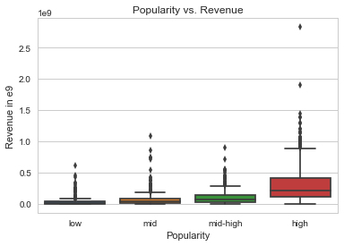


This section explores the relationship between revenue and popularity. The correlation coefficient equals 0.6, much higher than the one shown in the previous section. We use a similar methodology to reclassify the popularity variable, and find that the average revenue increases as the popularity climbs. To conclude, revenue and popularity is positively associated with each other.

### 4: Relationship between Revenue and Budget

#### Independent Variable: budget, Dependent Variable: revenue


```python
df_21.head()
```


<table border="1" class="dataframe">
  <thead>
    <tr style="text-align: right;">
      <th></th>
      <th>original_title</th>
      <th>revenue</th>
      <th>budget</th>
      <th>runtime</th>
      <th>popularity</th>
      <th>release_year</th>
      <th>runtime_level</th>
      <th>pop_level</th>
    </tr>
  </thead>
  <tbody>
    <tr>
      <th>0</th>
      <td>Jurassic World</td>
      <td>1.392446e+09</td>
      <td>1.379999e+08</td>
      <td>124</td>
      <td>32.985763</td>
      <td>2015-01-01</td>
      <td>long</td>
      <td>high</td>
    </tr>
    <tr>
      <th>1</th>
      <td>Mad Max: Fury Road</td>
      <td>3.481613e+08</td>
      <td>1.379999e+08</td>
      <td>120</td>
      <td>28.419936</td>
      <td>2015-01-01</td>
      <td>long</td>
      <td>high</td>
    </tr>
    <tr>
      <th>2</th>
      <td>Insurgent</td>
      <td>2.716190e+08</td>
      <td>1.012000e+08</td>
      <td>119</td>
      <td>13.112507</td>
      <td>2015-01-01</td>
      <td>long</td>
      <td>high</td>
    </tr>
    <tr>
      <th>3</th>
      <td>Star Wars: The Force Awakens</td>
      <td>1.902723e+09</td>
      <td>1.839999e+08</td>
      <td>136</td>
      <td>11.173104</td>
      <td>2015-01-01</td>
      <td>long</td>
      <td>high</td>
    </tr>
    <tr>
      <th>4</th>
      <td>Furious 7</td>
      <td>1.385749e+09</td>
      <td>1.747999e+08</td>
      <td>137</td>
      <td>9.335014</td>
      <td>2015-01-01</td>
      <td>long</td>
      <td>high</td>
    </tr>
  </tbody>
</table>
</div>


```python
plt.hist(df_21['budget'])

plt.xlabel('Budget')
plt.ylabel('Count')
plt.title('Distribution of Budget');
```


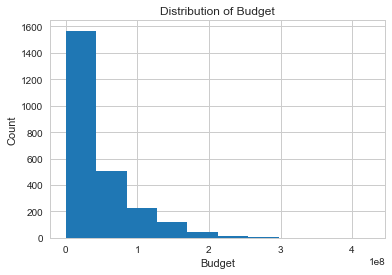


> The same right-skewed distribution


```python
df_21[['revenue', 'budget']].corr()
```


<table border="1" class="dataframe">
  <thead>
    <tr style="text-align: right;">
      <th></th>
      <th>revenue</th>
      <th>budget</th>
    </tr>
  </thead>
  <tbody>
    <tr>
      <th>revenue</th>
      <td>1.000000</td>
      <td>0.716031</td>
    </tr>
    <tr>
      <th>budget</th>
      <td>0.716031</td>
      <td>1.000000</td>
    </tr>
  </tbody>
</table>
</div>


```python
df_21.plot.scatter(x='budget', y='revenue', figsize = (10,6))

plt.xlabel('Budget in e8')
plt.ylabel('Revenue')
plt.title('Budget vs. Revenue');
```


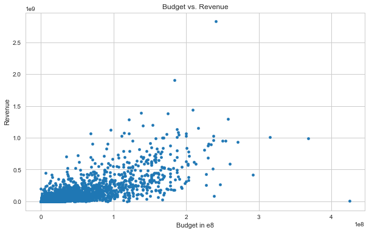


```python
df_21['budget'].describe()
```


    count    2.488000e+03
    mean     4.629471e+07
    std      4.857872e+07
    min      9.693980e-01
    25%      1.266215e+07
    50%      2.979344e+07
    75%      6.257853e+07
    max      4.250000e+08
    Name: budget, dtype: float64


```python
bin_edges2 = [df_21['budget'].describe()['min'], df_21['budget'].describe()['25%'], df_21['budget'].describe()['50%'], 
              df_21['budget'].describe()['75%'], df_21['budget'].describe()['max']]
bin_names2 = ['low','mid', 'mid-high', 'high']

df_21['budget_level'] = pd.cut(df_21['budget'], bin_edges2, labels=bin_names2)
```


```python
df_21.iloc[[x for x in np.arange(1,100,10)], :]
```


<table border="1" class="dataframe">
  <thead>
    <tr style="text-align: right;">
      <th></th>
      <th>original_title</th>
      <th>revenue</th>
      <th>budget</th>
      <th>runtime</th>
      <th>popularity</th>
      <th>release_year</th>
      <th>runtime_level</th>
      <th>pop_level</th>
      <th>budget_level</th>
    </tr>
  </thead>
  <tbody>
    <tr>
      <th>1</th>
      <td>Mad Max: Fury Road</td>
      <td>3.481613e+08</td>
      <td>1.379999e+08</td>
      <td>120</td>
      <td>28.419936</td>
      <td>2015-01-01</td>
      <td>long</td>
      <td>high</td>
      <td>high</td>
    </tr>
    <tr>
      <th>11</th>
      <td>Jupiter Ascending</td>
      <td>1.692686e+08</td>
      <td>1.619199e+08</td>
      <td>124</td>
      <td>6.189369</td>
      <td>2015-01-01</td>
      <td>long</td>
      <td>high</td>
      <td>high</td>
    </tr>
    <tr>
      <th>21</th>
      <td>Southpaw</td>
      <td>8.437300e+07</td>
      <td>2.759999e+07</td>
      <td>123</td>
      <td>5.337064</td>
      <td>2015-01-01</td>
      <td>long</td>
      <td>high</td>
      <td>mid</td>
    </tr>
    <tr>
      <th>32</th>
      <td>Pitch Perfect 2</td>
      <td>2.645056e+08</td>
      <td>2.667999e+07</td>
      <td>115</td>
      <td>3.877764</td>
      <td>2015-01-01</td>
      <td>mid-long</td>
      <td>high</td>
      <td>mid</td>
    </tr>
    <tr>
      <th>43</th>
      <td>The Man from U.N.C.L.E.</td>
      <td>9.949346e+07</td>
      <td>6.899997e+07</td>
      <td>116</td>
      <td>3.053421</td>
      <td>2015-01-01</td>
      <td>mid-long</td>
      <td>high</td>
      <td>high</td>
    </tr>
    <tr>
      <th>54</th>
      <td>Point Break</td>
      <td>1.230212e+08</td>
      <td>9.659996e+07</td>
      <td>114</td>
      <td>2.614499</td>
      <td>2015-01-01</td>
      <td>mid-long</td>
      <td>high</td>
      <td>high</td>
    </tr>
    <tr>
      <th>64</th>
      <td>Focus</td>
      <td>1.416459e+08</td>
      <td>4.609198e+07</td>
      <td>105</td>
      <td>2.395366</td>
      <td>2015-01-01</td>
      <td>mid</td>
      <td>high</td>
      <td>mid-high</td>
    </tr>
    <tr>
      <th>78</th>
      <td>The Night Before</td>
      <td>4.820430e+07</td>
      <td>2.299999e+07</td>
      <td>100</td>
      <td>2.096273</td>
      <td>2015-01-01</td>
      <td>mid</td>
      <td>high</td>
      <td>mid</td>
    </tr>
    <tr>
      <th>89</th>
      <td>Child 44</td>
      <td>3.058382e+06</td>
      <td>4.599998e+07</td>
      <td>137</td>
      <td>1.956320</td>
      <td>2015-01-01</td>
      <td>long</td>
      <td>high</td>
      <td>mid-high</td>
    </tr>
    <tr>
      <th>105</th>
      <td>The Wedding Ringer</td>
      <td>7.341586e+07</td>
      <td>2.115999e+07</td>
      <td>101</td>
      <td>1.510096</td>
      <td>2015-01-01</td>
      <td>mid</td>
      <td>mid-high</td>
      <td>mid</td>
    </tr>
  </tbody>
</table>
</div>


```python
df_21['budget_level'].value_counts()
```


    high        622
    mid-high    622
    mid         622
    low         621
    Name: budget_level, dtype: int64


```python
df_21.groupby('budget_level')['revenue'].mean()
```


    budget_level
    low         2.287363e+07
    mid         5.234459e+07
    mid-high    1.041229e+08
    high        3.244986e+08
    Name: revenue, dtype: float64


```python
sns.boxplot(x=df_21['budget_level'], y=df_21['revenue'])

plt.xlabel('Budget Level')
plt.ylabel('Revenue in e9')
plt.title('Budget vs. Revenue');
```


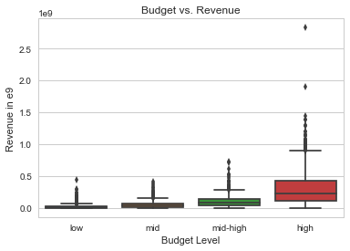


In this section, we dig into the relationship between budget and revenue. The Pearson Correlation Coefficient of 0.716 indicates that the two variables are highly correlated. Similar to the previous exploratory analyses, we seperate the budget into four categories. As the budget level increases, the average movie revenue tends to climb as well. Furthermore, the overall level of the last box in the boxplot is considerably higher than its counterparts. As a result, we conclude that movie revenue and budget is positively correlated.

<a id='conclusions'></a>
## Conclusions


This report uses the TMDb data from https://github.com/udacity/new-dand-basic-china/blob/master/%E6%95%B0%E6%8D%AE%E5%88%86%E6%9E%90%E5%85%A5%E9%97%A8/%E9%A1%B9%E7%9B%AE-%E6%8E%A2%E7%B4%A2%E6%95%B0%E6%8D%AE%E9%9B%86/%E6%8E%A2%E7%B4%A2%E6%95%B0%E6%8D%AE%E9%9B%86%20-%20%E5%A4%87%E9%80%89%E6%95%B0%E6%8D%AE%E9%9B%86.md, to explore the relationship between movie revenue and year, runtime, popularity as well as budget. The findings are as follows.

Generally speaking, the revenue increases from 2000 to 2015, but the numbers fluctuate quite a bit. What might also worth noticing is that the revenue is impacted by inflation. In other words, the value of 1 dollar differs in 2000 and 2015. For future research, we may consider using 2015 inflation level to normalize the movie revenues.

In addition, among runtime, popularity, and budget, the report discovers that the degree to which revenue and budget are associated to each other is the highest, while revenue and runtime are least correlated to one another. However, it does not indicate a causal relationship between independent and dependent variables.

Regarding the next steps, as previously mentioned, we can use cpi inflation calculator to normalize the revenue of each year. Secondly, we can also use regression methods to further explore the relationships between revenue and independent variables. And since the distributions of most variables are skewed, it would be more appropriate to perform log transformation before running regression.
